# Chicago Crime Arrest Prediction - MLOps Pipeline

[](https://www.python.org/downloads/)
[](https://airflow.apache.org/)
[](https://mlflow.org/)
[](https://fastapi.tiangolo.com/)

End-to-end MLOps pipeline for predicting arrest probability in Chicago crime incidents.

## 👥 Authors

- Daniel Eduardo Peñaranda Peralta
- Jorge Adrián Alvarez
- María Belén Cattaneo
- Nicolás Valentín Ciarrapico
- Sabrina Daiana Pryszczuk

---

## 📋 Table of Contents

- [Architecture](#-architecture)
- [Quick Start](#-quick-start)
- [Services](#-services)
- [ETL Pipeline](#-etl-pipeline)
- [Model Training](#-model-training)
- [API Reference](#-api-reference)
- [Configuration](#-configuration)
- [Troubleshooting](#-troubleshooting)

---

## 🏗 Architecture

```
┌─────────────────────────────────────────────────────────────────────────┐
│                           DATA SOURCES                                   │
│  ┌─────────────────────┐    ┌─────────────────────┐                     │
│  │ Chicago Data Portal │    │   Police Stations   │                     │
│  │   (Socrata API)     │    │      (Static)       │                     │
│  └──────────┬──────────┘    └──────────┬──────────┘                     │
└─────────────┼──────────────────────────┼────────────────────────────────┘
              │                          │
              ▼                          ▼
┌─────────────────────────────────────────────────────────────────────────┐
│                        ORCHESTRATION (Airflow)                           │
│  ┌────────┐ ┌────────┐ ┌────────┐ ┌────────┐ ┌────────┐ ┌────────┐     │
│  │Download│→│ Merge  │→│Enrich  │→│ Split  │→│Outliers│→│ Encode │     │
│  └────────┘ └────────┘ └────────┘ └────────┘ └────────┘ └────────┘     │
│                                                              │           │
│  ┌────────┐ ┌────────┐ ┌────────┐                           ▼           │
│  │Summary │←│Features│←│Balance │←──────────────────────────┘           │
│  └────────┘ └────────┘ └────────┘                                       │
└─────────────────────────────────────────────────────────────────────────┘
              │
              ▼
┌─────────────────────────────────────────────────────────────────────────┐
│                         STORAGE (MinIO S3)                               │
│  ┌─────────────────────────────────────────────────────────────────┐    │
│  │ s3://data/ml-ready-data/train_YYYY-MM-DD.csv                    │    │
│  │ s3://data/ml-ready-data/test_YYYY-MM-DD.csv                     │    │
│  └─────────────────────────────────────────────────────────────────┘    │
└─────────────────────────────────────────────────────────────────────────┘
              │
              ▼
┌─────────────────────────────────────────────────────────────────────────┐
│                    EXPERIMENT TRACKING (MLflow)                          │
│  ┌─────────────────┐  ┌─────────────────┐  ┌─────────────────┐         │
│  │   XGBoost       │  │ Random Forest   │  │    Other...     │         │
│  │   MCC: 0.54     │  │   MCC: 0.52     │  │                 │         │
│  └────────┬────────┘  └─────────────────┘  └─────────────────┘         │
│           │                                                              │
│           ▼                                                              │
│  ┌─────────────────────────────────────────────────────────────────┐    │
│  │              MODEL REGISTRY (champion alias)                     │    │
│  └─────────────────────────────────────────────────────────────────┘    │
└─────────────────────────────────────────────────────────────────────────┘
              │
              ▼
┌─────────────────────────────────────────────────────────────────────────┐
│                         SERVING (FastAPI)                                │
│  ┌─────────────────────────────────────────────────────────────────┐    │
│  │  POST /predict       - Single prediction                        │    │
│  │  POST /predict/batch - Batch predictions (up to 1000)           │    │
│  │  GET  /model/info    - Model metadata and metrics               │    │
│  │  GET  /health        - Health check (200/503)                   │    │
│  └─────────────────────────────────────────────────────────────────┘    │
└─────────────────────────────────────────────────────────────────────────┘
```

---

## 🚀 Quick Start

### Prerequisites

- [Docker](https://docs.docker.com/engine/install/) (with Docker Compose)
- 8GB RAM minimum
- 10GB disk space

### Installation

```bash
# 1. Clone repository
git clone <repository-url>
cd MLOPS-main

# 2. Create directories
mkdir -p airflow/{config,dags,logs,plugins}
chmod 777 airflow/logs

# 3. Configure environment
cat > .env << EOF
AIRFLOW_UID=$(id -u)
SOCRATA_APP_TOKEN=your_token_here
DATA_REPO_BUCKET_NAME=data
EOF

# 4. Start services
make install && make up

# 5. Verify (all services should be "healthy")
docker ps
```

### Get Socrata API Token

1. Go to [Chicago Data Portal](https://data.cityofchicago.org/)
2. Sign in → My Profile → Developer Settings
3. Create New App Token
4. Copy token to `.env` file

### Access Services

| Service | URL | Credentials |
|---------|-----|-------------|
| **Airflow** | http://localhost:8080 | `airflow` / `airflow` |
| **MLflow** | http://localhost:5001 | - |
| **MinIO** | http://localhost:9001 | `minio` / `minio123` |
| **API Docs** | http://localhost:8800/docs | - |

---

## 🔧 Services

| Service | Purpose | Port |
|---------|---------|------|
| **Airflow** | ETL orchestration | 8080 |
| **MLflow** | Experiment tracking & model registry | 5001 |
| **MinIO** | S3-compatible object storage | 9000/9001 |
| **PostgreSQL** | Metadata storage | 5432 |
| **FastAPI** | Model serving REST API | 8800 |
| **Valkey** | Celery broker (Redis fork) | 6379 |

---

## 📊 ETL Pipeline

The `etl_with_taskflow` DAG processes Chicago crime data through 11 stages:

| Stage | Description | Output |
|-------|-------------|--------|
| 1. Setup S3 | Create bucket, set lifecycle | - |
| 2. Download | Fetch from Socrata API | `0-raw-data/` |
| 3. Merge | Rolling 12-month window | `1-merged-data/` |
| 4. Enrich | Add geospatial + temporal features | `2-enriched-data/` |
| 5. Split | Train/test (80/20 stratified) | `3-split-data/` |
| 6. Outliers | Remove outliers (±3σ) | `4-outliers/` |
| 7. Encode | Frequency, cyclic, one-hot encoding | `5-encoded/` |
| 8. Scale | StandardScaler normalization | `6-scaled/` |
| 9. Balance | SMOTE + RandomUnderSampler | `7-balanced/` |
| 10. Features | Mutual Information selection | `ml-ready-data/` |
| 11. Summary | Log pipeline metrics to MLflow | - |

### Run ETL

**Manual trigger:**
```bash
# Via Airflow UI
open http://localhost:8080  # DAG: etl_with_taskflow → Play

# Via CLI
docker-compose run airflow-cli dags trigger etl_with_taskflow
```

**Schedule:** Monthly (1st day at 00:00)

---

## 🧪 Model Training

### Train XGBoost Model

```bash
docker-compose run trainer python mlflow_xgboost_poc_docker.py
```

### Assign Champion Alias

    %% --- 1. ETL ---
    subgraph S1 ["1. ETL PIPELINE (Airflow)"]
        direction TB
        %% Definimos el flujo interno
        N1("📥 Download Data &rarr; Enrich Data<br>⚙️ Process Data&rarr; ML-Ready Data"):::title
        D1("💾 MinIO s3://data/<br>------------------<br>• [Raw Data]<br>• [Enriched Data]<br>• [Processed]<br>• [Train/Test]"):::content
        N1 --> D1
    end

    %% --- 2. EXPERIMENTACIÓN ---
    subgraph S2 ["2. EXPERIMENTACIÓN"]
        direction TB
        N2("🧪 Notebooks/Scripts"):::title
        D2("🤖 Modelos:<br>• Exp. 1: Logistic Regression<br>• Exp. 2: Random Forest<br>• Exp. 3: XGBoost<br><br>📊 MLflow Tracking UI:<br>• Metrics: Accuracy, Precision, Recall, F1, AUC<br>• Params: Hyperparameters, Features, Data version<br>• Artifacts: Model, Charts, Feature importance"):::content
        N2 --> D2
    end

    %% --- 3. REGISTRO DE MODELO---
    subgraph S3 ["3. REGISTRO (MLflow)"]
        direction TB
        N3("🥇 Model Registry"):::title
        D3("📋 Flujo:<br>1. Seleccionar Mejor<br>2. Registrar Versión<br>3. Stage: 'Staging'<br>4. Stage: 'Production'"):::content
        N3 --> D3
    end

    %% --- 4. DESPLIEGUE ---
    subgraph S4 ["4. DESPLIEGUE (FastAPI)"]
        direction TB
        N4("🚀 API REST"):::title
        D4("🔌 Endpoints:<br>------------------<br>• POST /predict<br>  (Predicción individual)<br>• POST /predict/batch<br>  (Predicción por lote)<br>• GET /model/info (Info del modelo en uso)"):::content
        N4 --> D4
    end

    %% --- 5. MONITOREO ---
    subgraph S5 ["5. MANTENIMIENTO"]
        direction TB
        N5("🛡️ Monitoreo"):::title
        D5("⚠️ Data Drift check<br>📈 Performance tracking<br>🔄 Automated Retraining (AirFlow DAG)<br>🆚 A/B Testing (Champion/Challenger)"):::content
        N5 --> D5
    end

    %% --- CONEXIONES ---
    S1 --> S2
    S2 --> S3
    S3 --> S4
    S4 --> S5
    
    %% --- RETROALIMENTACION ---
    D5 -.-> |Trigger New Run| S1
```
---

## 🔧 ETL Pipeline

### Descripción General

Pipeline ETL automatizado que procesa datos de crímenes de Chicago desde la API pública hasta datasets ML-ready.

### Arquitectura del Pipeline
<details>
  <summary><strong>🔻 Clic aquí para ver el Diagrama de Flujo Versión Texto (ASCII)</strong></summary>

  ```text
┌─────────────┐   ┌─────────────┐   ┌─────────────┐   ┌─────────────┐
│   Setup     │ → │  Download   │ → │   Enrich    │ → │    Split    │
│     S3      │   │    Data     │   │    Data     │   │    Data     │
└─────────────┘   └─────────────┘   └─────────────┘   └─────────────┘
                                                              ↓
┌─────────────┐   ┌─────────────┐   ┌─────────────┐   ┌─────────────┐
│   Extract   │ ← │   Balance   │ ← │    Scale    │ ← │   Encode    │
│  Features   │   │    Data     │   │    Data     │   │    Data     │
└─────────────┘   └─────────────┘   └─────────────┘   └─────────────┘
      ↓
┌─────────────┐
│   Pipeline  │
│   Summary   │
└─────────────┘
```
</details>



```mermaid
graph LR
    %% Cambiamos a LR (Left to Right) para que sea horizontal
    
    %% Estilos "Dark Mode Friendly" (Fondo oscuro, letra blanca)
    classDef steps fill:#1f425f,stroke:#82b1ff,stroke-width:2px,color:white,rx:5,ry:5;
    classDef startend fill:#1b4d3e,stroke:#4cc9f0,stroke-width:2px,color:white,rx:5,ry:5;

    %% Nodos
    A[Setup<br>S3]:::startend
    B[Download<br>Data]:::steps
    C[Enrich<br>Data]:::steps
    D[Split<br>Data]:::steps
    E[Encode<br>Data]:::steps
    F[Scale<br>Data]:::steps
    G[Balance<br>Data]:::steps
    H[Extract<br>Features]:::steps
    I[Pipeline<br>Summary]:::startend

    %% Conexiones
    A --> B
    B --> C
    C --> D
    D --> E
    E --> F
    F --> G
    G --> H
    H --> I
```

### Etapas del Pipeline

#### 1️⃣ Setup S3
- Crea bucket MinIO si no existe
- Configura política de lifecycle (TTL 60 días para datos temporales)

#### 2️⃣ Download Data
- **Fuente:** [Chicago Data Portal](https://data.cityofchicago.org/) via Socrata API
- **Descarga inicial:** Año completo (~450k registros)
- **Descargas subsecuentes:** Incremental mensual (~35k registros)
- **Output:** `s3://data/0-raw-data/monthly-data/{YYYY-MM}/crimes.csv`

#### 3️⃣ Enrich Data
- **Geoespacial:** Distancia a estación policial más cercana (GeoPandas)
- **Temporal:**
  - Season (Winter/Spring/Summer/Autumn)
  - Day of week (0=Monday, 6=Sunday) - encoded as sine for cyclical pattern
  - Day time (Early Morning/Morning/Afternoon/Night)
- **Limpieza:** Duplicados, valores nulos
- **Output:** `s3://data/1-enriched-data/crimes_enriched_{date}.csv`
- **Monitoring:** Logs raw data quality metrics to MLflow

#### 4️⃣ Split Data
- **Estrategia:** Stratified train/test split (80/20)
- **Target:** `arrest` (boolean)
- **Output:**
  - `s3://data/2-split-data/crimes_train_{date}.csv`
  - `s3://data/2-split-data/crimes_test_{date}.csv`
- **Monitoring:** Logs class distribution to MLflow

#### 5️⃣ Process Outliers
- **Método:** IQR-based outlier removal
- **Log transformation:** `distance_crime_to_police_station`
- **Output:** `s3://data/3-outliers-data/`

#### 6️⃣ Encode Data
- **One-hot:** Low cardinality (season, day_time)
- **Frequency:** High cardinality (primary_type, location_description)
- **Cyclic:** Day of week (sine transformation)
- **Label:** Boolean features (domestic)
- **Output:** `s3://data/4-encoded-data/`

#### 7️⃣ Scale Data
- **Método:** StandardScaler (zero mean, unit variance)
- **Features:** Numeric only (coordinates, distances)
- **Output:** `s3://data/5-scaled-data/`

#### 8️⃣ Balance Data
- **Problema:** ~84% no arrest, ~16% arrest
- **Solución:** SMOTE + RandomUnderSampler
  - SMOTE: Oversample minority to 50% of majority
  - Undersampling: Final ratio 80% (minority = 80% of majority)
- **Output:** `s3://data/6-balanced-data/`
- **Monitoring:** Logs balancing impact to MLflow

#### 9️⃣ Extract Features
- **Método:** Mutual Information feature selection
- **Threshold:** MI score > 0.05
- **Features finales:** ~11 features (de ~20 originales)
- **Output:** `s3://data/ml-ready-data/train_{date}.csv`
- **Monitoring:** Logs feature importance and correlation to MLflow

#### 🔟 Pipeline Summary
- **Consolidación:** Métricas de todo el pipeline
- **Visualización:** Flow chart mostrando transformación de datos
- **Output:** MLflow run con pipeline overview

### Estructura de Datos en MinIO

```
s3://data/
├── 0-raw-data/
│   └── monthly-data/
│       └── {YYYY-MM}/
│           ├── crimes.csv              # ~35k registros/mes
│           └── police_stations.csv     # 23 estaciones
├── 1-enriched-data/
│   └── crimes_enriched_{date}.csv      # +3 features temporales
├── 2-split-data/
│   ├── crimes_train_{date}.csv         # 80%
│   └── crimes_test_{date}.csv          # 20%
├── 3-outliers-data/
│   ├── train_{date}.csv
│   └── test_{date}.csv
├── 4-encoded-data/
│   ├── train_{date}.csv
│   └── test_{date}.csv
├── 5-scaled-data/
│   ├── train_{date}.csv
│   └── test_{date}.csv
├── 6-balanced-data/
│   ├── train_{date}.csv                # ~173k registros (balanced)
│   └── test_{date}.csv
└── ml-ready-data/                      # ⭐ USAR ESTE PARA EXPERIMENTS
    ├── train_{date}.csv                # ~173k × 11 features
    └── test_{date}.csv                 # ~46k × 11 features
```

### Ejecución del Pipeline

**Trigger manual en Airflow UI:**
1. Navegar a http://localhost:8080
2. Buscar DAG: `etl_with_taskflow`
3. Click en ▶️ (Play) para ejecutar

**Schedule automático:**
- **Frecuencia:** `@monthly` (primer día de cada mes a las 00:00)
- **Catchup:** Habilitado (procesa meses faltantes)
- **Max Active Runs:** 1 (evita ejecuciones concurrentes)

## Variables de entorno requeridas

Antes de ejecutar `make install`, asegúrate de configurar las siguientes variables en el archivo `.env`:

```bash
# Requeridas para el pipeline ETL
SOCRATA_APP_TOKEN=tu_token_aqui    # Token de Socrata API (ver instrucciones abajo)
DATA_REPO_BUCKET_NAME=data          # Bucket MinIO para datos

# Ya configuradas por defecto (modificar solo si es necesario)
AIRFLOW_UID=1000                    # UID del usuario para Airflow
AWS_ACCESS_KEY_ID=minio             # Credenciales MinIO
AWS_SECRET_ACCESS_KEY=minio123      # Credenciales MinIO
```

### Obtener Token de Socrata (Chicago Data Portal)

El pipeline ETL descarga datos del Chicago Data Portal usando la API de Socrata. Para evitar límites de tasa, necesitas un App Token:

1. Ir a https://data.cityofchicago.org/
2. Crear una cuenta o iniciar sesión (click en "Sign In" arriba a la derecha)
3. Una vez logueado, ir a tu perfil (click en tu nombre) → "Developer Settings"
4. Click en "Create New App Token"
5. Completar el formulario:
   - **Application Name**: Nombre descriptivo (ej: "MLOps CEIA")
   - **Description**: Descripción breve
   - **Website** (opcional): Puede dejarse vacío
6. Click en "Save" y copiar el **App Token** generado
7. Agregar el token al archivo `.env`:
   ```bash
   SOCRATA_APP_TOKEN=tu_token_generado_aqui
   ```

> **Nota**: Sin el token, el pipeline funcionará pero con límites de velocidad más restrictivos.

## Comandos disponibles (Makefile)
### Monitoreo del Pipeline

Cada etapa del pipeline registra métricas en **MLflow**:

**Runs creados automáticamente:**
- `raw_data_{date}` - Calidad de datos crudos
- `split_{date}` - Distribución train/test
- `balance_{date}` - Impacto del balanceo
- `features_{date}` - Feature selection results
- `pipeline_summary_{date}` - Overview completo

**Artifacts en MLflow:**
- `charts/raw_data_overview.png` - 4 gráficos de datos crudos
- `charts/split_distribution.png` - Comparación train/test
- `charts/balance_comparison.png` - Antes/después balanceo
- `charts/feature_importance.png` - Top 10 features (MI score)
- `charts/correlation_heatmap.png` - Correlación entre features
- `charts/pipeline_flow.png` - ⭐ Data flow completo

---

## 🧪 Experimentación y Entrenamiento

### Acceso a Datos ML-Ready

Los datos procesados están disponibles en MinIO para tus experimentos:

```python
import os
import pandas as pd
import boto3

# Configurar conexión a MinIO
os.environ["AWS_ACCESS_KEY_ID"] = "minio"
os.environ["AWS_SECRET_ACCESS_KEY"] = "minio123"
os.environ["AWS_ENDPOINT_URL_S3"] = "http://localhost:9000"

# Descargar datos
s3 = boto3.client('s3', endpoint_url='http://localhost:9000')

# Usar la última versión disponible (o especificar fecha)
train_df = pd.read_csv('s3://data/ml-ready-data/train_2025-11-22.csv')
test_df = pd.read_csv('s3://data/ml-ready-data/test_2025-11-22.csv')

# Separar features y target
X_train = train_df.drop('arrest', axis=1)
y_train = train_df['arrest']
X_test = test_df.drop('arrest', axis=1)
y_test = test_df['arrest']
```

### Template de Experimentación

Ejemplo de experimento con tracking en MLflow:

```bash
docker-compose run trainer python -c "
import mlflow
mlflow.set_tracking_uri('http://mlflow:5000')
client = mlflow.tracking.MlflowClient()
client.set_registered_model_alias('xgboost_chicago_crimes', 'champion', '1')
print('Champion alias set!')
"
```

### View Experiments

Open MLflow UI: http://localhost:5001

---

## 🌐 API Reference

### Health Check

```bash
curl http://localhost:8800/health
# 200: {"status": "healthy", "model_loaded": true, ...}
# 503: {"status": "degraded", "model_loaded": false, ...}
```

### Single Prediction

```bash
curl -X POST http://localhost:8800/predict \
  -H "Content-Type: application/json" \
  -d '{
    "iucr_freq": 0.435,
  "primary_type_freq": 0.123,
    "location_description_freq": 0.045,
    
    "day_of_week_sin": 0.781,
    "x_coordinate_standardized": 1.234,
    
    "y_coordinate_standardized": -1.123,
    "distance_crime_to_police_station_standardized": 0.345
  }'
```

**Response:**
```json
{
  "prediction": true,
  "probability": 0.87,
  "model_version": "1",
  "timestamp": "2025-12-13T15:30:00Z"
}
```

### Batch Prediction

```bash
curl -X POST http://localhost:8800/predict/batch \
  -H "Content-Type: application/json" \
  -d '{
    "iucr_freq": 0.435,
    "primary_type_freq": 0.123,
    "location_description_freq": 0.045,
    "day_of_week_sin": 0.781,
    "x_coordinate_standardized": 1.234,
    "y_coordinate_standardized": -1.123,
    "distance_crime_to_police_station_standardized": 0.345
  }'
```

**Python:**
```python
import requests

url = "http://localhost:8800/predict"
data = {
    "primary_type_freq": 0.123,
    "location_description_freq": 0.045,
    # ... resto de features
}

response = requests.post(url, json=data)
print(response.json())
```

### Model Info

```bash
curl http://localhost:8800/model/info
```

### Reload Model

```bash
curl -X POST http://localhost:8800/model/reload
```

---

## ⚙ Configuration

### Environment Variables

Create `.env` in project root:

```bash
# 1. Editar requirements.txt en dockerfiles/airflow/ o dockerfiles/fastapi/
# 2. Reconstruir
make install
```

**Reiniciar desde cero:**
```bash
make clean
make install && make up
```

## ETL Pipeline: Chicago Crime Data

El proyecto incluye un pipeline ETL completo para análisis de crímenes en Chicago:

### Arquitectura del Pipeline

**Task 1: setup_s3**
- Crea bucket MinIO si no existe
- Configura política de lifecycle (TTL de 60 días para datos temporales)

**Task 2: download_data**
- Descarga datos de crímenes desde Socrata API (Chicago Data Portal)
- Descarga datos de estaciones policiales
- Primera ejecución: descarga año completo (~260k registros)
- Ejecuciones subsecuentes: descarga incremental mensual (~25k registros)
- Guarda en MinIO: `raw-data/crimes_YYYY-MM-DD.csv` y `raw-data/police_stations.csv`

**Task 3: enrich_data**
- Carga datos desde MinIO
- Calcula distancia a estación policial más cercana (GeoPandas spatial join)
- Crea features temporales:
  - Season (Winter/Spring/Summer/Autumn)
  - Day of week (0-6) - encoded as sine for cyclical pattern
  - Day time (Early Morning/Morning/Afternoon/Night)
- Guarda en MinIO: `raw-data/crimes_enriched_YYYY-MM-DD.csv`

**Tasks 4-8:** (Por implementar)
- `split_data` - División train/test (80/20 estratificado)
- `process_outliers` - Manejo de outliers y transformación logarítmica
- `encode_data` - Encoding de variables categóricas
- `scale_data` - Escalado con StandardScaler
- `balance_data` - Balanceo con SMOTE + RandomUnderSampler
- `extract_features` - Selección de features con Mutual Information

### Estructura de Módulos

```
airflow/dags/
├── etl_process_taskflow.py       # DAG principal con TaskFlow API
└── etl_helpers/
    ├── __init__.py               # Package initialization
    ├── minio_utils.py            # Operaciones MinIO/S3
    ├── data_loader.py            # Descarga desde Socrata API
    └── data_enrichment.py        # Enriquecimiento geoespacial y temporal
```

### Configuración

Las variables de entorno requeridas (`SOCRATA_APP_TOKEN`, `DATA_REPO_BUCKET_NAME`) están documentadas en la sección [Variables de entorno requeridas](#variables-de-entorno-requeridas) al inicio de este documento.

**Dependencias principales:**
- `sodapy` - Cliente Socrata API
- `geopandas` - Cálculos geoespaciales
- `shapely` - Geometrías
- `pandas` - Manipulación de datos

### Ejecución

**Trigger manual:**
1. Abrir Airflow UI: `make airflow`
2. Localizar DAG: `etl_with_taskflow`
3. Click en "Play" para ejecutar

**Ejecución automática:**
- Schedule: `@monthly` (primer día de cada mes)
- Primera ejecución: descarga año completo
- Subsecuentes: solo último mes

### Monitoreo

**Ver logs:**
```bash
# Levantar CLI
docker compose --profile all --profile debug up

# Ejemplos de uso
docker-compose run airflow-cli config list              # Ver configuración
docker-compose run airflow-cli dags list                # Listar DAGs
docker-compose run airflow-cli tasks list etl_with_taskflow  # Listar tasks
docker-compose run airflow-cli dags trigger etl_with_taskflow  # Trigger manual
```

---

## ⚙️ Configuración Avanzada

### Variables de Entorno (.env)

```bash
# Airflow
AIRFLOW_UID=50000                    # UID del usuario (Linux/Mac)
AIRFLOW_IMAGE_NAME=extending_airflow:latest

# PostgreSQL
PG_USER=airflow
PG_PASSWORD=airflow
MINIO_ACCESS_KEY=minio
MINIO_SECRET_ACCESS_KEY=minio123
MLFLOW_PORT=5001
FASTAPI_PORT=8800
```

### ETL Configuration

See `airflow/dags/etl_helpers/config.py`:

| Variable | Default | Description |
|----------|---------|-------------|
| `SPLIT_TEST_SIZE` | 0.2 | Test set proportion |
| `OUTLIER_STD_THRESHOLD` | 3 | Standard deviations for outlier removal |
| `MI_THRESHOLD` | 0.05 | Mutual Information threshold for feature selection |
| `SMOTE_SAMPLING_STRATEGY` | 0.5 | SMOTE oversampling ratio |

---

## 🛠 Commands

```bash
make help      # Show all commands
make up        # Start all services
make down      # Stop all services
make restart   # Restart all services
make install   # Rebuild containers
make clean     # Remove all containers and volumes
make logs      # Follow logs
make status    # Show service status
make lint      # Run linter
make format    # Format code
```

---

## 🔧 Troubleshooting

### Port 5000 conflict (macOS)

AirPlay uses port 5000. MLflow is configured to use port 5001 by default.

### Permission denied on airflow/logs

```bash
chmod 777 airflow/logs
```

### Model not loading in API

```bash
# 1. Check if model is registered
curl http://localhost:8800/health

# 2. Reload model
curl -X POST http://localhost:8800/model/reload

# 3. Check MLflow for champion alias
docker-compose run trainer python -c "
import mlflow
mlflow.set_tracking_uri('http://mlflow:5000')
client = mlflow.tracking.MlflowClient()
model = client.get_registered_model('xgboost_chicago_crimes')
print('Aliases:', model.aliases)
"
```

### ETL fails at balance_data

This was fixed. Ensure NaN values are handled in `data_splitter.py`.

---

## 📁 Project Structure

```
MLOPS-main/
├── airflow/
│   ├── dags/
│   │   ├── etl_process_taskflow.py    # Main ETL DAG
│   │   └── etl_helpers/               # ETL modules
│   │       ├── config.py              # Centralized configuration
│   │       ├── data_loader.py         # Socrata API client
│   │       ├── data_enrichment.py     # Geospatial features
│   │       ├── data_splitter.py       # Train/test split
│   │       ├── data_encoding.py       # Feature encoding
│   │       ├── data_scaling.py        # Normalization
│   │       ├── data_balancing.py      # SMOTE balancing
│   │       ├── feature_selection.py   # MI-based selection
│   │       ├── monitoring.py          # MLflow logging
│   │       └── minio_utils.py         # S3 operations
│   └── secrets/                        # Airflow secrets
├── dockerfiles/
│   ├── airflow/                        # Airflow image
│   ├── fastapi/                        # API image
│   ├── mlflow/                         # MLflow image
│   ├── postgres/                       # PostgreSQL image
│   └── trainer/                        # Training image
├── mlflow_scripts/
│   ├── mlflow_xgboost_poc_docker.py   # XGBoost training script
│   ├── champion_challenger.py          # Model promotion
│   └── predictor.py                    # Prediction utilities
├── docker-compose.yaml                 # Service definitions
├── Makefile                            # Command shortcuts
└── README.md                           # This file
```

---

## 📄 License

Apache License 2.0

---

## 🤝 Contributing

Pull requests are welcome. For major changes, please open an issue first.
