```mermaid 
graph LR
    %% --- ESTILOS ---
    %% Estilo para las cajas de contenido (alineadas a la izquierda para listas)
    classDef content fill:#0d1117,stroke:#30363d,stroke-width:1px,color:#c9d1d9,text-align:left,rx:5,ry:5;
    %% Estilo para los títulos de las etapas
    classDef title fill:#161b22,stroke:#1f6feb,stroke-width:2px,color:#58a6ff,font-weight:bold;

    %% --- 1. ETL ---
    subgraph S1 ["1. ETL PIPELINE (Airflow)"]
        direction TB
        %% Definimos el flujo interno
        N1("📥 Download Data &rarr; Enrich Data<br>⚙️ Process Data&rarr; ML-Ready Data"):::title
        D1("💾 MinIO s3://data/<br>------------------<br>• [Raw Data]<br>• [Enriched Data]<br>• [Processed]<br>• [Train/Test]"):::content
        N1 --> D1
    end

    %% --- 2. EXPERIMENTACIÓN ---
    subgraph S2 ["2. EXPERIMENTACIÓN"]
        direction TB
        N2("🧪 Notebooks/Scripts"):::title
        D2("🤖 Modelos:<br>• Exp. 1: Logistic Regression<br>• Exp. 2: Random Forest<br>• Exp. 3: XGBoost<br><br>📊 MLflow Tracking UI:<br>• Metrics: Accuracy, Precision, Recall, F1, AUC<br>• Params: Hyperparameters, Features, Data version<br>• Artifacts: Model, Charts, Feature importance"):::content
        N2 --> D2
    end

    %% --- 3. REGISTRO DE MODELO---
    subgraph S3 ["3. REGISTRO (MLflow)"]
        direction TB
        N3("🥇 Model Registry"):::title
        D3("📋 Flujo:<br>1. Seleccionar Mejor<br>2. Registrar Versión<br>3. Stage: 'Staging'<br>4. Stage: 'Production'"):::content
        N3 --> D3
    end

    %% --- 4. DESPLIEGUE ---
    subgraph S4 ["4. DESPLIEGUE (FastAPI)"]
        direction TB
        N4("🚀 API REST"):::title
        D4("🔌 Endpoints:<br>------------------<br>• POST /predict<br>  (Predicción individual)<br>• POST /predict/batch<br>  (Predicción por lote)<br>• GET /model/info (Info del modelo en uso)"):::content
        N4 --> D4
    end

    %% --- 5. MONITOREO ---
    subgraph S5 ["5. MANTENIMIENTO"]
        direction TB
        N5("🛡️ Monitoreo"):::title
        D5("⚠️ Data Drift check<br>📈 Performance tracking<br>🔄 Automated Retraining (AirFlow DAG)<br>🆚 A/B Testing (Champion/Challenger)"):::content
        N5 --> D5
    end

    %% --- CONEXIONES ---
    S1 --> S2
    S2 --> S3
    S3 --> S4
    S4 --> S5
    
    %% --- RETROALIMENTACION ---
    D5 -.-> |Trigger New Run| S1
```

# Proyecto Final – Operaciones de aprendizaje automático I
### Implementación en ambiente productivo de un modelo de ML para la Predicción de Arrestos en Crímenes Reportados en la Ciudad de Chicago

## Descripción General

Este proyecto implementa un **pipeline de Machine Learning end-to-end** orientado a la predicción de la probabilidad de que **un delito registrado en la ciudad de Chicago** derive en un arresto.
El modelo utiliza un conjunto de variables diseñadas para capturar información clave del evento delictivo, entre ellas:

* **Características del crimen**: código IUCR, categoría primaria, clasificación del FBI y tipo de delito.
* **Información geoespacial**: coordenadas del incidente, distrito policial, área comunitaria y otros atributos territoriales.
* **Contexto temporal**: fecha y hora del hecho, día de la semana, estación del año y otras transformaciones temporales relevantes.
* **Proximidad operativa**: distancia al destacamento policial más cercano, incorporada como feature para capturar la influencia de la presencia policial.

## Objetivo del modelo

El objetivo del modelo es estimar la probabilidad de arresto asociado a un incidente delictivo en la ciudad de Chicago, utilizando un enfoque supervisado de clasificación.
El sistema toma como entrada los registros históricos del Chicago Police Department y genera predicciones basadas en un conjunto de features que integran información criminal, espacial, temporal y operativa (presencia policial).
Este modelo constituye el núcleo del pipeline, sobre el cual se montan las tareas de entrenamiento, validación, seguimiento y despliegue

---

## 👩‍💻 Autores

- **Daniel Eduardo Peñaranda Peralta**
- **Jorge Adrián Alvarez**
- **María Belén Cattaneo**
- **Nicolás Valentín Ciarrapico**
- **Sabrina Daiana Pryszczuk**

---

## 📋 Tabla de Contenidos

1. [Arquitectura del Sistema](#-arquitectura-del-sistema)
2. [Instalación](#-instalación)
3. [Flujo de Trabajo Completo](#-flujo-de-trabajo-completo)
4. [ETL Pipeline](#-etl-pipeline)
5. [Experimentación y Entrenamiento](#-experimentación-y-entrenamiento)
6. [Despliegue del Modelo](#-despliegue-del-modelo)
7. [API de Predicción](#-api-de-predicción)
8. [Monitoreo y MLflow](#-monitoreo-y-mlflow)
9. [Comandos Útiles](#-comandos-útiles)
10. [Configuración Avanzada](#-configuración-avanzada)

---

## 🏗️ Arquitectura del Sistema

Este proyecto implementa un pipeline MLOps completo con los siguientes servicios:

- **[Apache Airflow](https://airflow.apache.org/)** - Orquestación de ETL y reentrenamiento
- **[MLflow](https://mlflow.org/)** - Tracking de experimentos y registro de modelos
- **[FastAPI](https://fastapi.tiangolo.com/)** - API REST para servir predicciones
- **[MinIO](https://min.io/)** - Almacenamiento de objetos S3-compatible
- **[PostgreSQL](https://www.postgresql.org/)** - Base de datos relacional
- **[ValKey](https://valkey.io/)** - Base de datos key-value (Redis fork)


### Recursos Creados Automáticamente

**Buckets MinIO:**
- `s3://data` - Almacenamiento de datos del pipeline ETL
- `s3://mlflow` - Artefactos de experimentos y modelos

**Bases de Datos PostgreSQL:**
- `mlflow_db` - Metadata de MLflow
- `airflow` - Metadata de Airflow

---

## 🚀 Instalación

### Requisitos Previos

- [Docker](https://docs.docker.com/engine/install/) instalado
- Al menos 8GB RAM disponible
- 10GB espacio en disco

### Pasos de Instalación

1. **Clonar el repositorio:**
   ```bash
   git clone <repository-url>
   cd MLOPS
   ```

2. **Configurar permisos (Linux/MacOS):**
   ```bash
   # Crear carpetas necesarias
   mkdir -p airflow/{config,dags,logs,plugins}

   # Configurar UID en .env (encuentra tu UID con: id -u)
   echo "AIRFLOW_UID=$(id -u)" >> .env
   ```

3. **Configurar variables de entorno:**

   Edita el archivo `.env` y añade tu token de Socrata API:
   ```bash
   SOCRATA_APP_TOKEN=tu_token_aqui
   ```

   Obtén tu token gratis en: https://data.cityofchicago.org/

4. **Levantar servicios:**
   ```bash
   make install && make up
   ```

   O usando docker-compose directamente:
   ```bash
   docker compose --profile all up
   ```

5. **Verificar estado:**
   ```bash
   docker ps -a  # Todos los servicios deben estar "healthy"
   ```

6. **Acceder a las interfaces:**
   - **Airflow UI:** http://localhost:8080 (user: `airflow`, pass: `airflow`)
   - **MLflow UI:** http://localhost:5001
   - **MinIO Console:** http://localhost:9001 (user: `minio`, pass: `minio123`)
   - **API Docs:** http://localhost:8800/docs
   - **API:** http://localhost:8800

> **Nota:** Si usas un servidor remoto, reemplaza `localhost` por la IP del servidor.

---

## 🔄 Flujo de Trabajo Completo

Este proyecto sigue un flujo MLOps end-to-end:

<details>
  <summary><strong>🔻 Clic aquí para ver el Diagrama de Flujo Versión Texto (ASCII)</strong></summary>

  ```text
┌─────────────────────────────────────────────────────────────────┐
│                     1. ETL PIPELINE (Airflow)                   │
│  ┌──────────┐   ┌──────────┐   ┌──────────┐   ┌──────────┐    │
│  │ Download │ → │ Enrich   │ → │ Process  │ → │ ML-Ready │    │
│  │   Data   │   │   Data   │   │   Data   │   │   Data   │    │
│  └──────────┘   └──────────┘   └──────────┘   └──────────┘    │
│       ↓              ↓              ↓              ↓            │
│  [Raw Data]   [Enriched Data] [Processed]  [Train/Test]        │
│   MinIO s3://data/                                              │
└─────────────────────────────────────────────────────────────────┘
                            ↓
┌─────────────────────────────────────────────────────────────────┐
│              2. EXPERIMENTACIÓN (Notebooks/Scripts)             │
│  ┌──────────────┐   ┌──────────────┐   ┌──────────────┐       │
│  │ Experiment 1 │   │ Experiment 2 │   │ Experiment N │       │
│  │ (Logistic    │   │ (Random      │   │ (XGBoost)    │       │
│  │  Regression) │   │  Forest)     │   │              │       │
│  └──────────────┘   └──────────────┘   └──────────────┘       │
│         ↓                  ↓                  ↓                 │
│     MLflow Tracking UI - Comparación de métricas               │
│  ┌─────────────────────────────────────────────────────┐       │
│  │ Metrics: Accuracy, Precision, Recall, F1, AUC       │       │
│  │ Params: Hyperparameters, Features, Data version     │       │
│  │ Artifacts: Model, Charts, Feature importance        │       │
│  └─────────────────────────────────────────────────────┘       │
└─────────────────────────────────────────────────────────────────┘
                            ↓
┌─────────────────────────────────────────────────────────────────┐
│                3. REGISTRO DE MODELO (MLflow)                   │
│  ┌────────────────────────────────────────────────────┐        │
│  │ Seleccionar mejor modelo → Register → Production   │        │
│  │ Model Registry: Versioning, Staging, Production    │        │
│  └────────────────────────────────────────────────────┘        │
└─────────────────────────────────────────────────────────────────┘
                            ↓
┌─────────────────────────────────────────────────────────────────┐
│                  4. DESPLIEGUE (FastAPI)                        │
│  ┌──────────────────────────────────────────────────┐          │
│  │  API carga modelo desde MLflow Model Registry    │          │
│  │  Endpoints:                                       │          │
│  │  - POST /predict - Predicción individual         │          │
│  │  - POST /predict/batch - Predicción por lote     │          │
│  │  - GET /model/info - Info del modelo en uso      │          │
│  └──────────────────────────────────────────────────┘          │
└─────────────────────────────────────────────────────────────────┘
                            ↓
┌─────────────────────────────────────────────────────────────────┐
│              5. MONITOREO Y REENTRENAMIENTO                     │
│  ┌──────────────────────────────────────────────────┐          │
│  │  - Data drift monitoring                         │          │
│  │  - Model performance tracking                    │          │
│  │  - Automated retraining (Airflow DAG)            │          │
│  │  - A/B testing (Champion/Challenger)             │          │
│  └──────────────────────────────────────────────────┘          │
└─────────────────────────────────────────────────────────────────┘
```
</details>


---

## 🔧 ETL Pipeline

### Descripción General

Pipeline ETL automatizado que procesa datos de crímenes de Chicago desde la API pública hasta datasets ML-ready.

### Arquitectura del Pipeline
<details>
  <summary><strong>🔻 Clic aquí para ver el Diagrama de Flujo Versión Texto (ASCII)</strong></summary>

  ```text
┌─────────────┐   ┌─────────────┐   ┌─────────────┐   ┌─────────────┐
│   Setup     │ → │  Download   │ → │   Enrich    │ → │    Split    │
│     S3      │   │    Data     │   │    Data     │   │    Data     │
└─────────────┘   └─────────────┘   └─────────────┘   └─────────────┘
                                                              ↓
┌─────────────┐   ┌─────────────┐   ┌─────────────┐   ┌─────────────┐
│   Extract   │ ← │   Balance   │ ← │    Scale    │ ← │   Encode    │
│  Features   │   │    Data     │   │    Data     │   │    Data     │
└─────────────┘   └─────────────┘   └─────────────┘   └─────────────┘
      ↓
┌─────────────┐
│   Pipeline  │
│   Summary   │
└─────────────┘
```
</details>


### Etapas del Pipeline

#### 1️⃣ Setup S3
- Crea bucket MinIO si no existe
- Configura política de lifecycle (TTL 60 días para datos temporales)

#### 2️⃣ Download Data
- **Fuente:** [Chicago Data Portal](https://data.cityofchicago.org/) via Socrata API
- **Descarga inicial:** Año completo (~450k registros)
- **Descargas subsecuentes:** Incremental mensual (~35k registros)
- **Output:** `s3://data/0-raw-data/monthly-data/{YYYY-MM}/crimes.csv`

#### 3️⃣ Enrich Data
- **Geoespacial:** Distancia a estación policial más cercana (GeoPandas)
- **Temporal:**
  - Season (Winter/Spring/Summer/Fall)
  - Day of week (0=Monday, 6=Sunday)
  - Day time (Morning/Afternoon/Evening/Night)
- **Limpieza:** Duplicados, valores nulos
- **Output:** `s3://data/1-enriched-data/crimes_enriched_{date}.csv`
- **Monitoring:** Logs raw data quality metrics to MLflow

#### 4️⃣ Split Data
- **Estrategia:** Stratified train/test split (80/20)
- **Target:** `arrest` (boolean)
- **Output:**
  - `s3://data/2-split-data/crimes_train_{date}.csv`
  - `s3://data/2-split-data/crimes_test_{date}.csv`
- **Monitoring:** Logs class distribution to MLflow

#### 5️⃣ Process Outliers
- **Método:** IQR-based outlier removal
- **Log transformation:** `distance_crime_to_police_station`
- **Output:** `s3://data/3-outliers-data/`

#### 6️⃣ Encode Data
- **One-hot:** Low cardinality (season, day_time)
- **Frequency:** High cardinality (primary_type, location_description)
- **Cyclic:** Day of week (sine transformation)
- **Label:** Boolean features (domestic)
- **Output:** `s3://data/4-encoded-data/`

#### 7️⃣ Scale Data
- **Método:** StandardScaler (zero mean, unit variance)
- **Features:** Numeric only (coordinates, distances)
- **Output:** `s3://data/5-scaled-data/`

#### 8️⃣ Balance Data
- **Problema:** ~84% no arrest, ~16% arrest
- **Solución:** SMOTE + RandomUnderSampler
  - SMOTE: Oversample minority to 50% of majority
  - Undersampling: Final ratio 80% (minority = 80% of majority)
- **Output:** `s3://data/6-balanced-data/`
- **Monitoring:** Logs balancing impact to MLflow

#### 9️⃣ Extract Features
- **Método:** Mutual Information feature selection
- **Threshold:** MI score > 0.05
- **Features finales:** ~11 features (de ~20 originales)
- **Output:** `s3://data/ml-ready-data/train_{date}.csv`
- **Monitoring:** Logs feature importance and correlation to MLflow

#### 🔟 Pipeline Summary
- **Consolidación:** Métricas de todo el pipeline
- **Visualización:** Flow chart mostrando transformación de datos
- **Output:** MLflow run con pipeline overview

### Estructura de Datos en MinIO

```
s3://data/
├── 0-raw-data/
│   └── monthly-data/
│       └── {YYYY-MM}/
│           ├── crimes.csv              # ~35k registros/mes
│           └── police_stations.csv     # 23 estaciones
├── 1-enriched-data/
│   └── crimes_enriched_{date}.csv      # +3 features temporales
├── 2-split-data/
│   ├── crimes_train_{date}.csv         # 80%
│   └── crimes_test_{date}.csv          # 20%
├── 3-outliers-data/
│   ├── train_{date}.csv
│   └── test_{date}.csv
├── 4-encoded-data/
│   ├── train_{date}.csv
│   └── test_{date}.csv
├── 5-scaled-data/
│   ├── train_{date}.csv
│   └── test_{date}.csv
├── 6-balanced-data/
│   ├── train_{date}.csv                # ~173k registros (balanced)
│   └── test_{date}.csv
└── ml-ready-data/                      # ⭐ USAR ESTE PARA EXPERIMENTS
    ├── train_{date}.csv                # ~173k × 11 features
    └── test_{date}.csv                 # ~46k × 11 features
```

### Ejecución del Pipeline

**Trigger manual en Airflow UI:**
1. Navegar a http://localhost:8080
2. Buscar DAG: `etl_with_taskflow`
3. Click en ▶️ (Play) para ejecutar

**Schedule automático:**
- **Frecuencia:** `@monthly` (primer día de cada mes a las 00:00)
- **Catchup:** Habilitado (procesa meses faltantes)
- **Max Active Runs:** 1 (evita ejecuciones concurrentes)

## Variables de entorno requeridas

Antes de ejecutar `make install`, asegúrate de configurar las siguientes variables en el archivo `.env`:

```bash
# Requeridas para el pipeline ETL
SOCRATA_APP_TOKEN=tu_token_aqui    # Token de Socrata API (ver instrucciones abajo)
DATA_REPO_BUCKET_NAME=data          # Bucket MinIO para datos

# Ya configuradas por defecto (modificar solo si es necesario)
AIRFLOW_UID=1000                    # UID del usuario para Airflow
AWS_ACCESS_KEY_ID=minio             # Credenciales MinIO
AWS_SECRET_ACCESS_KEY=minio123      # Credenciales MinIO
```

### Obtener Token de Socrata (Chicago Data Portal)

El pipeline ETL descarga datos del Chicago Data Portal usando la API de Socrata. Para evitar límites de tasa, necesitas un App Token:

1. Ir a https://data.cityofchicago.org/
2. Crear una cuenta o iniciar sesión (click en "Sign In" arriba a la derecha)
3. Una vez logueado, ir a tu perfil (click en tu nombre) → "Developer Settings"
4. Click en "Create New App Token"
5. Completar el formulario:
   - **Application Name**: Nombre descriptivo (ej: "MLOps CEIA")
   - **Description**: Descripción breve
   - **Website** (opcional): Puede dejarse vacío
6. Click en "Save" y copiar el **App Token** generado
7. Agregar el token al archivo `.env`:
   ```bash
   SOCRATA_APP_TOKEN=tu_token_generado_aqui
   ```

> **Nota**: Sin el token, el pipeline funcionará pero con límites de velocidad más restrictivos.

## Comandos disponibles (Makefile)
### Monitoreo del Pipeline

Cada etapa del pipeline registra métricas en **MLflow**:

**Runs creados automáticamente:**
- `raw_data_{date}` - Calidad de datos crudos
- `split_{date}` - Distribución train/test
- `balance_{date}` - Impacto del balanceo
- `features_{date}` - Feature selection results
- `pipeline_summary_{date}` - Overview completo

**Artifacts en MLflow:**
- `charts/raw_data_overview.png` - 4 gráficos de datos crudos
- `charts/split_distribution.png` - Comparación train/test
- `charts/balance_comparison.png` - Antes/después balanceo
- `charts/feature_importance.png` - Top 10 features (MI score)
- `charts/correlation_heatmap.png` - Correlación entre features
- `charts/pipeline_flow.png` - ⭐ Data flow completo

---

## 🧪 Experimentación y Entrenamiento

### Acceso a Datos ML-Ready

Los datos procesados están disponibles en MinIO para tus experimentos:

```python
import os
import pandas as pd
import boto3

# Configurar conexión a MinIO
os.environ["AWS_ACCESS_KEY_ID"] = "minio"
os.environ["AWS_SECRET_ACCESS_KEY"] = "minio123"
os.environ["AWS_ENDPOINT_URL_S3"] = "http://localhost:9000"

# Descargar datos
s3 = boto3.client('s3', endpoint_url='http://localhost:9000')

# Usar la última versión disponible (o especificar fecha)
train_df = pd.read_csv('s3://data/ml-ready-data/train_2025-11-22.csv')
test_df = pd.read_csv('s3://data/ml-ready-data/test_2025-11-22.csv')

# Separar features y target
X_train = train_df.drop('arrest', axis=1)
y_train = train_df['arrest']
X_test = test_df.drop('arrest', axis=1)
y_test = test_df['arrest']
```

### Template de Experimentación

Ejemplo de experimento con tracking en MLflow:

```python
import mlflow
import mlflow.sklearn
from sklearn.linear_model import LogisticRegression
from sklearn.metrics import accuracy_score, precision_score, recall_score, f1_score, roc_auc_score

# Configurar MLflow
mlflow.set_tracking_uri("http://localhost:5001")
mlflow.set_experiment("chicago-crime-arrest-prediction")

# Iniciar run
with mlflow.start_run(run_name="logistic_regression_baseline"):

    # Log parameters
    params = {
        "model_type": "LogisticRegression",
        "solver": "lbfgs",
        "max_iter": 1000,
        "class_weight": "balanced",
        "data_version": "2025-11-22"
    }
    mlflow.log_params(params)

    # Entrenar modelo
    model = LogisticRegression(**{k: v for k, v in params.items()
                                   if k not in ['model_type', 'data_version']})
    model.fit(X_train, y_train)

    # Predecir
    y_pred = model.predict(X_test)
    y_pred_proba = model.predict_proba(X_test)[:, 1]

    # Log metrics
    metrics = {
        "accuracy": accuracy_score(y_test, y_pred),
        "precision": precision_score(y_test, y_pred),
        "recall": recall_score(y_test, y_pred),
        "f1": f1_score(y_test, y_pred),
        "roc_auc": roc_auc_score(y_test, y_pred_proba)
    }
    mlflow.log_metrics(metrics)

    # Log model
    mlflow.sklearn.log_model(
        model,
        "model",
        registered_model_name="chicago-crime-arrest-predictor"
    )

    print(f"✅ Experiment logged to MLflow: {mlflow.active_run().info.run_id}")
```

### Comparación de Experimentos

Accede a MLflow UI para comparar experimentos:

1. **Navegar a:** http://localhost:5001
2. **Seleccionar experimento:** `chicago-crime-arrest-prediction`
3. **Comparar runs:** Seleccionar múltiples runs y click en "Compare"
4. **Visualizar:**
   - Parallel coordinates plot
   - Scatter plot (metric vs metric)
   - Metric history
   - Artifact comparison

### Modelos Sugeridos para Experimentar

| Modelo | Fortalezas | Hiperparámetros clave |
|--------|------------|----------------------|
| Logistic Regression | Baseline rápido, interpretable | `C`, `solver`, `class_weight` |
| Random Forest | Robusto, feature importance | `n_estimators`, `max_depth`, `min_samples_split` |
| XGBoost | Alto rendimiento, manejo de desbalance | `learning_rate`, `max_depth`, `scale_pos_weight` |
| LightGBM | Rápido, eficiente en memoria | `num_leaves`, `learning_rate`, `feature_fraction` |
| CatBoost | Manejo automático de categóricas | `iterations`, `learning_rate`, `depth` |

---

## 🚀 Despliegue del Modelo

### Registro del Modelo en MLflow

1. **Entrenar y loguear modelo** (ver sección Experimentación)

2. **Registrar modelo en Model Registry:**
   ```python
   # Opción 1: Durante el training
   mlflow.sklearn.log_model(
       model,
       "model",
       registered_model_name="chicago-crime-arrest-predictor"
   )

   # Opción 2: Desde run existente
   run_id = "abc123..."
   model_uri = f"runs:/{run_id}/model"
   mlflow.register_model(model_uri, "chicago-crime-arrest-predictor")
   ```

3. **Promover a Production:**
   ```python
   from mlflow.tracking import MlflowClient

   client = MlflowClient()

   # Obtener última versión
   model_name = "chicago-crime-arrest-predictor"
   latest_version = client.get_latest_versions(model_name, stages=["None"])[0]

   # Promover a Production
   client.transition_model_version_stage(
       name=model_name,
       version=latest_version.version,
       stage="Production"
   )
   ```

### FastAPI - Carga del Modelo

La API carga automáticamente el modelo en stage "Production" desde MLflow:

```python
# En dockerfiles/fastapi/app/main.py
import mlflow.pyfunc

MODEL_NAME = "chicago-crime-arrest-predictor"
model = mlflow.pyfunc.load_model(f"models:/{MODEL_NAME}/Production")
```

---

## 🌐 API de Predicción

### Endpoints Disponibles

#### 1. Predicción Individual

```bash
POST /predict
```

**Request:**
```json
{
  "primary_type_freq": 0.123,
  "location_description_freq": 0.045,
  "beat_freq": 0.012,
  "ward_freq": 0.034,
  "community_area_freq": 0.028,
  "day_of_week_sin": 0.781,
  "x_coordinate_standardized": 1.234,
  "longitude_standardized": -0.567,
  "latitude_standardized": 0.890,
  "y_coordinate_standardized": -1.123,
  "distance_crime_to_police_station_standardized": 0.345
}
```

**Response:**
```json
{
  "prediction": true,
  "probability": 0.78,
  "model_version": "2",
  "timestamp": "2025-11-22T10:30:00Z"
}
```

#### 2. Predicción por Lote

```bash
POST /predict/batch
```

**Request:**
```json
{
  "instances": [
    { "primary_type_freq": 0.123, ... },
    { "primary_type_freq": 0.456, ... }
  ]
}
```

**Response:**
```json
{
  "predictions": [
    {
      "prediction": true,
      "probability": 0.78
    },
    {
      "prediction": false,
      "probability": 0.23
    }
  ],
  "model_version": "2",
  "timestamp": "2025-11-22T10:30:00Z"
}
```

#### 3. Información del Modelo

```bash
GET /model/info
```

**Response:**
```json
{
  "name": "chicago-crime-arrest-predictor",
  "version": "2",
  "stage": "Production",
  "description": "XGBoost classifier for arrest prediction",
  "metrics": {
    "accuracy": 0.85,
    "precision": 0.82,
    "recall": 0.79,
    "f1": 0.80,
    "roc_auc": 0.91
  }
}
```

### Ejemplos de Uso

**cURL:**
```bash
curl -X POST "http://localhost:8800/predict" \
  -H "Content-Type: application/json" \
  -d '{
    "primary_type_freq": 0.123,
    "location_description_freq": 0.045,
    "beat_freq": 0.012,
    "ward_freq": 0.034,
    "community_area_freq": 0.028,
    "day_of_week_sin": 0.781,
    "x_coordinate_standardized": 1.234,
    "longitude_standardized": -0.567,
    "latitude_standardized": 0.890,
    "y_coordinate_standardized": -1.123,
    "distance_crime_to_police_station_standardized": 0.345
  }'
```

**Python:**
```python
import requests

url = "http://localhost:8800/predict"
data = {
    "primary_type_freq": 0.123,
    "location_description_freq": 0.045,
    # ... resto de features
}

response = requests.post(url, json=data)
print(response.json())
```

**Documentación Interactiva:**
- Swagger UI: http://localhost:8800/docs
- ReDoc: http://localhost:8800/redoc

---

## 📊 Monitoreo y MLflow

### Acceso a MLflow UI

```bash
# Abrir en navegador
open http://localhost:5001

# O usar make command
make mlflow
```

### Experiments Creados

| Experiment | Descripción | Runs |
|------------|-------------|------|
| `Default` | Runs del pipeline ETL | `raw_data_*`, `split_*`, `balance_*`, `features_*`, `pipeline_summary_*` |
| `chicago-crime-arrest-prediction` | Experimentos de modelos | Tus experiments de entrenamiento |

### Métricas del Pipeline (ETL)

Cada ejecución del pipeline crea 5 runs en MLflow:

**1. `raw_data_{date}`**
- Métricas: total_records, arrest_rate_pct, unique_districts, etc.
- Artifacts: `charts/raw_data_overview.png`

**2. `split_{date}`**
- Métricas: train_size, test_size, class distribution
- Artifacts: `charts/split_distribution.png`

**3. `balance_{date}`**
- Métricas: original_size, balanced_size, class_ratio improvement
- Artifacts: `charts/balance_comparison.png`

**4. `features_{date}`**
- Métricas: selected_features, dropped_features, feature_reduction_pct
- Artifacts: `charts/feature_importance.png`, `charts/correlation_heatmap.png`

**5. `pipeline_summary_{date}` ⭐**
- Métricas: Todas las counts + retention percentages
- Artifacts: `charts/pipeline_flow.png` (overview completo del pipeline)

### Model Registry

**Estados del Modelo:**
- `None` - Recién registrado
- `Staging` - En pruebas
- `Production` - Desplegado en API
- `Archived` - Versión antigua

**Transiciones:**
```python
from mlflow.tracking import MlflowClient

client = MlflowClient()

# Staging → Production
client.transition_model_version_stage(
    name="chicago-crime-arrest-predictor",
    version="3",
    stage="Production"
)

# Archivar versión antigua
client.transition_model_version_stage(
    name="chicago-crime-arrest-predictor",
    version="2",
    stage="Archived"
)
```

---

## 🛠️ Comandos Útiles

### Makefile Commands

```bash
make help      # Muestra todos los comandos disponibles
make up        # Inicia todos los servicios
make down      # Detiene todos los servicios
make restart   # Reinicia todos los servicios
make install   # Reconstruye contenedores con nuevas dependencias
make clean     # Detiene y elimina todo (⚠️ borra datos)
make logs      # Muestra logs de todos los servicios
make status    # Estado de todos los servicios
```

### Flujos de Trabajo Comunes

**Primera vez:**
```bash
make install && make up
```

**Agregar dependencias:**
```bash
# 1. Editar requirements.txt en dockerfiles/airflow/ o dockerfiles/fastapi/
# 2. Reconstruir
make install
```

**Reiniciar desde cero:**
```bash
make clean
make install && make up
```

## ETL Pipeline: Chicago Crime Data

El proyecto incluye un pipeline ETL completo para análisis de crímenes en Chicago:

### Arquitectura del Pipeline

**Task 1: setup_s3**
- Crea bucket MinIO si no existe
- Configura política de lifecycle (TTL de 60 días para datos temporales)

**Task 2: download_data**
- Descarga datos de crímenes desde Socrata API (Chicago Data Portal)
- Descarga datos de estaciones policiales
- Primera ejecución: descarga año completo (~260k registros)
- Ejecuciones subsecuentes: descarga incremental mensual (~25k registros)
- Guarda en MinIO: `raw-data/crimes_YYYY-MM-DD.csv` y `raw-data/police_stations.csv`

**Task 3: enrich_data**
- Carga datos desde MinIO
- Calcula distancia a estación policial más cercana (GeoPandas spatial join)
- Crea features temporales:
  - Season (Winter/Spring/Summer/Fall)
  - Day of week (0-6)
  - Day time (Morning/Afternoon/Evening/Night)
- Guarda en MinIO: `raw-data/crimes_enriched_YYYY-MM-DD.csv`

**Tasks 4-8:** (Por implementar)
- `split_data` - División train/test (80/20 estratificado)
- `process_outliers` - Manejo de outliers y transformación logarítmica
- `encode_data` - Encoding de variables categóricas
- `scale_data` - Escalado con StandardScaler
- `balance_data` - Balanceo con SMOTE + RandomUnderSampler
- `extract_features` - Selección de features con Mutual Information

### Estructura de Módulos

```
airflow/dags/
├── etl_process_taskflow.py       # DAG principal con TaskFlow API
└── etl_helpers/
    ├── __init__.py               # Package initialization
    ├── minio_utils.py            # Operaciones MinIO/S3
    ├── data_loader.py            # Descarga desde Socrata API
    └── data_enrichment.py        # Enriquecimiento geoespacial y temporal
```

### Configuración

Las variables de entorno requeridas (`SOCRATA_APP_TOKEN`, `DATA_REPO_BUCKET_NAME`) están documentadas en la sección [Variables de entorno requeridas](#variables-de-entorno-requeridas) al inicio de este documento.

**Dependencias principales:**
- `sodapy` - Cliente Socrata API
- `geopandas` - Cálculos geoespaciales
- `shapely` - Geometrías
- `pandas` - Manipulación de datos

### Ejecución

**Trigger manual:**
1. Abrir Airflow UI: `make airflow`
2. Localizar DAG: `etl_with_taskflow`
3. Click en "Play" para ejecutar

**Ejecución automática:**
- Schedule: `@monthly` (primer día de cada mes)
- Primera ejecución: descarga año completo
- Subsecuentes: solo último mes

### Monitoreo

**Ver logs:**
```bash
# Levantar CLI
docker compose --profile all --profile debug up

# Ejemplos de uso
docker-compose run airflow-cli config list              # Ver configuración
docker-compose run airflow-cli dags list                # Listar DAGs
docker-compose run airflow-cli tasks list etl_with_taskflow  # Listar tasks
docker-compose run airflow-cli dags trigger etl_with_taskflow  # Trigger manual
```

---

## ⚙️ Configuración Avanzada

### Variables de Entorno (.env)

```bash
# Airflow
AIRFLOW_UID=50000                    # UID del usuario (Linux/Mac)
AIRFLOW_IMAGE_NAME=extending_airflow:latest

# PostgreSQL
PG_USER=airflow
PG_PASSWORD=airflow
PG_DATABASE=airflow
PG_PORT=5432

# MinIO
MINIO_ACCESS_KEY=minio
MINIO_SECRET_ACCESS_KEY=minio123
MINIO_PORT=9000
MINIO_PORT_UI=9001

# MLflow
MLFLOW_PORT=5001
MLFLOW_BUCKET_NAME=mlflow

# Data
DATA_REPO_BUCKET_NAME=data
SOCRATA_APP_TOKEN=tu_token_aqui     # ⚠️ REQUERIDO

# FastAPI
FASTAPI_PORT=8800
```

### Conexión a MinIO desde Local

Para usar boto3, awscli, o pandas desde tu máquina local:

```bash
make airflow   # Ver DAG runs y logs
make minio     # Ver archivos en buckets
```

### Datos de Salida

**Ubicación:** MinIO bucket `data/`

**Estructura:**
```
data/
├── 0-raw-data/
│   ├── monthly-data/
│   │   └── {YYYY-MM}/
│   │       ├── crimes.csv              # Crímenes descargados del mes
│   │       └── police_stations.csv     # Estaciones policiales
│   └── data/
│       └── crimes_12m_{YYYY-MM-DD}.csv # Ventana rolling 12 meses
├── 1-enriched-data/
│   └── crimes_enriched_{YYYY-MM-DD}.csv # Crímenes enriquecidos
└── 2-processed-data/                    # (Próximos pasos)
    ├── train_encoded.csv
    ├── test_encoded.csv
    └── ...
```

## Apagar los servicios

Estos servicios ocupan cierta cantidad de memoria RAM y procesamiento, por lo que cuando no se están utilizando, se recomienda detenerlos. Para hacerlo, ejecuta:

```bash
make down
```

**Eliminar todo (⚠️ borra datos):**
```bash
make clean
```

**Usando docker-compose directamente:**
```bash
# Solo detener
docker compose --profile all down

# Eliminar todo
docker compose down --rmi all --volumes
```

**Nota:** Si haces esto, perderás todo en los buckets y bases de datos.

## Aspectos específicos de Airflow

### Variables de entorno
Airflow ofrece una amplia gama de opciones de configuración. En el archivo `docker-compose.yaml`, dentro de `x-airflow-common`, se encuentran variables de entorno que pueden modificarse para ajustar la configuración de Airflow. Pueden añadirse [otras variables](https://airflow.apache.org/docs/apache-airflow/stable/configurations-ref.html).

### Uso de ejecutores externos
Actualmente, para este caso, Airflow utiliza un ejecutor [celery](https://airflow.apache.org/docs/apache-airflow/stable/core-concepts/executor/celery.html), lo que significa que las tareas se ejecutan en otro contenedor. 

### Uso de la CLI de Airflow

Si necesitan depurar Apache Airflow, pueden utilizar la CLI de Apache Airflow de la siguiente manera:

```bash
docker compose --profile all --profile debug up
```

Una vez que el contenedor esté en funcionamiento, pueden utilizar la CLI de Airflow de la siguiente manera, 
por ejemplo, para ver la configuración:

```bash
docker-compose run airflow-cli config list      
```

Para obtener más información sobre el comando, pueden consultar [aqui](https://airflow.apache.org/docs/apache-airflow/stable/cli-and-env-variables-ref.html).

### Variables y Conexiones

Si desean agregar variables para accederlas en los DAGs, pueden hacerlo en `secrets/variables.yaml`. Para obtener más [información](https://airflow.apache.org/docs/apache-airflow/stable/core-concepts/variables.html), 
consulten la documentación.

Si desean agregar conexiones en Airflow, pueden hacerlo en `secrets/connections.yaml`. También es posible agregarlas mediante la interfaz de usuario (UI), pero estas no persistirán si se borra todo. Por otro lado, cualquier conexión guardada en `secrets/connections.yaml` no aparecerá en la UI, aunque eso no significa que no exista. Consulten la documentación para obtener más 
[información](https://airflow.apache.org/docs/apache-airflow/stable/authoring-and-scheduling/connections.html).

## Conexión con los buckets

Dado que no estamos utilizando Amazon S3, sino una implementación local de los mismos mediante MinIO, es necesario modificar las variables de entorno para conectar con el servicio de MinIO. Las variables de entorno son las siguientes:

```bash
AWS_ACCESS_KEY_ID=minio   
AWS_SECRET_ACCESS_KEY=minio123 
AWS_ENDPOINT_URL_S3=http://localhost:90000
```

MLflow también tiene una variable de entorno que afecta su conexión a los buckets:

```bash
MLFLOW_S3_ENDPOINT_URL=http://localhost:9000
```
Asegúrate de establecer estas variables de entorno antes de ejecutar tu notebook o scripts en tu máquina o en cualquier otro lugar. Si estás utilizando un servidor externo a tu computadora de trabajo, reemplaza localhost por su dirección IP.

Al hacer esto, podrás utilizar `boto3`, `awswrangler`, etc., en Python con estos buckets, o `awscli` en la consola.

Si tienes acceso a AWS S3, ten mucho cuidado de no reemplazar tus credenciales de AWS. Si usas las variables de entorno, no tendrás problemas.

## Valkey

La base de datos Valkey es usada por Apache Airflow para su funcionamiento. Tal como está configurado ahora no esta expuesto el puerto para poder ser usado externamente. Se puede modificar el archivo `docker-compose.yaml` para habilitaro.

## Pull Request

Este repositorio está abierto para que realicen sus propios Pull Requests y así contribuir a mejorarlo. Si desean realizar alguna modificación, **¡son bienvenidos!** También se pueden crear nuevos entornos productivos para aumentar la variedad de implementaciones, idealmente en diferentes `branches`. Algunas ideas que se me ocurren que podrían implementar son:

- Reemplazar Airflow y MLflow con [Metaflow](https://metaflow.org/) o [Kubeflow](https://www.kubeflow.org).
- Reemplazar MLflow con [Seldon-Core](https://github.com/SeldonIO/seldon-core).
- Agregar un servicio de tableros como, por ejemplo, [Grafana](https://grafana.com).
