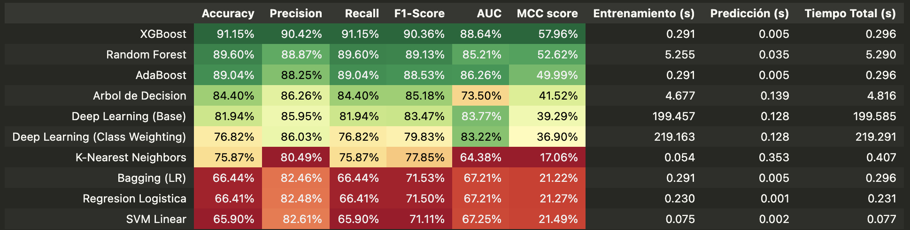
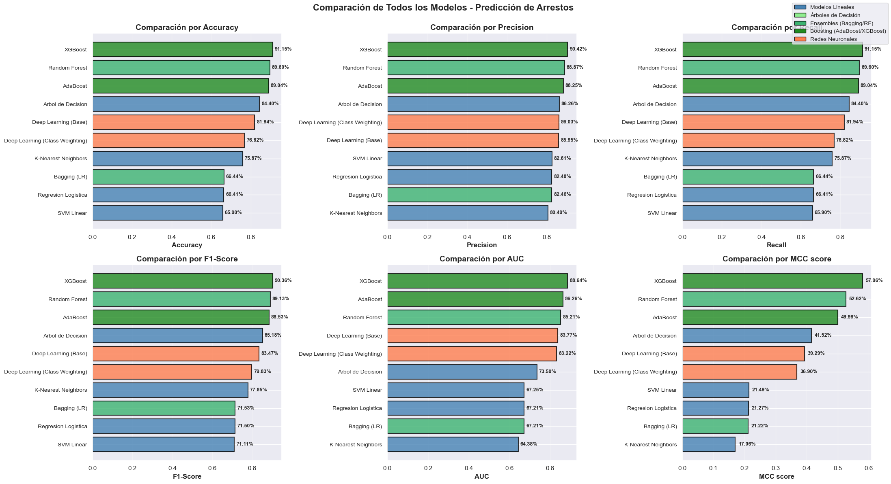

### Métricas de Comparación Elegidas

Para evaluar nuestros modelos de clasificación utilizamos un conjunto de métricas que nos ofrecen una visión completa del rendimiento del modelo, especialmente en su capacidad para identificar la clase minoritaria (Arrest_tag=1).

1. *Exactitud (*Accuracy)**

    * Es el porcentaje total de predicciones correctas (Verdaderos Positivos + Verdaderos Negativos) sobre el total de muestras.
    * Proporciona una visión global y rápida del rendimiento general. Sin embargo, la usamos con precaución, ya que en un dataset desbalanceado, un modelo que siempre predice la clase mayoritaria puede obtener una exactitud alta pero ser inútil.

2. *Precisión (*Precision)**

    * Mide la calidad de las predicciones positivas. Responde a la pregunta: "De todos los casos que el modelo predijo como Arrest_tag=1, ¿cuántos eran realmente Arrest_tag=1?"
    * Es crucial cuando el costo de un Falso Positivo es alto. Queremos estar seguros de que cuando el modelo "levanta una alarma" (predice un 1), tiene razón la mayoría de las veces.

3. *Sensibilidad (*Recall)**

    * Mide la capacidad del modelo para encontrar todos los casos positivos. Responde a la pregunta: "De todos los casos que realmente eran Arrest_tag=1, ¿cuántos logró detectar el modelo?"
    * Es la métrica más importante cuando el costo de un Falso Negativo es alto. En nuestro caso, "no detectar" un caso de arresto (un 1) es probablemente el peor error, por lo que un Recall alto es fundamental.

4. *Puntuación F1 (*F1-Score)**

    * Es la media armónica entre Precisión y Sensibilidad. Proporciona una sola puntuación que balancea ambas métricas.
    * Es una métrica de resumen excelente cuando nos importan tanto los Falsos Positivos como los Falsos Negativos. Un modelo debe tener buena Precisión y buena Sensibilidad para obtener un F1-Score alto.

5. *Coeficiente de Correlación de Matthews (MCC)*

    * Mide la calidad de la clasificación binaria considerando las cuatro categorías de la matriz de confusión (VP, VN, FP, FN). Su resultado es un valor entre -1 (desacuerdo total) y +1 (acuerdo perfecto), donde 0 es un rendimiento aleatorio.
    * Es considerada la métrica más robusta y fiable para datasets desbalanceados. A diferencia del F1-Score, el MCC también incluye explícitamente los Verdaderos Negativos en su cálculo, dándonos una medida de correlación completa y equilibrada entre la predicción y la realidad

6. *AUC (Área Bajo la Curva ROC)* 
    * Mide la capacidad del modelo para discriminar entre la clase positiva (1) y la negativa (0). Representa la probabilidad de que el modelo le asigne una puntuación (probabilidad) más alta al caso positivo que al negativo.
    * Su principal ventaja es que es independiente del umbral de decisión.

## Análisis de resultados

El modelo seleccionado para este proyecto es XGBoost.

Esta decisión se fundamenta en su clara superioridad en las dos métricas más críticas para este problema de clasificación: el Coeficiente de Correlación de Matthews (MCC) y el Área Bajo la Curva (AUC).

XGBoost obtuvo el MCC más alto con un 57.96%. Esto indica que, después de haber entrenado con el set de datos ya balanceado, XGBoost demostró ser el modelo más capaz de aprender los patrones subyacentes y correlacionar sus predicciones con la realidad de forma equilibrada. Asimismo, su AUC de 88.64% demuestra la mayor capacidad del conjunto para discriminar correctamente entre los casos que resultarán en un arresto y los que no.

Más allá de su rendimiento predictivo, XGBoost también cumple sobradamente con el requisito de eficiencia. Su tiempo de predicción de 0.005 segundos es uno de los más rápidos, asegurando su viabilidad en un contexto de uso real.

Aunque AdaBoost iguala su velocidad, su rendimiento predictivo es notablemente inferior (49.99% de MCC). Random Forest, si bien es competente, tiene un tiempo de predicción ocho veces más lento. Por lo tanto, XGBoost representa la combinación óptima de poder de aprendizaje y eficiencia computacional para este problema.

Las redes neuronales, si bien no fueron optimizadas para entrenamiento en GPU o TPU, no resultan adecuadas para este caso de estudio, dado que el volumen de datos es limitado y la cantidad de variables (features) relativamente baja. En este contexto, los métodos de ensamble —como XGBoost, Random Forest y AdaBoost— demuestran un mejor desempeño tanto en métricas de precisión (MCC, F1, AUC) como en eficiencia computacional, evidenciando que son más apropiados para problemas tabulares con conjuntos de datos moderados.

En comparación con los métodos lineales, como la regresión logística o el SVM lineal, se observa un desempeño considerablemente inferior en todas las métricas evaluadas (Accuracy, F1-Score, AUC y MCC). Esto sugiere que el problema bajo estudio presenta relaciones no lineales entre las variables, las cuales estos modelos no logran capturar adecuadamente.

El algoritmo K-Nearest Neighbors (KNN), aunque no lineal, logra resultados intermedios, lo que refuerza la hipótesis de que la estructura del conjunto de datos no se ajusta a una frontera lineal. No obstante, su bajo MCC (17%) indica limitaciones en la capacidad de generalización y en el manejo del desbalance de clases.

En síntesis, los métodos de ensamble basados en árboles resultan claramente superiores tanto frente a los modelos lineales como a las redes neuronales, combinando un buen equilibrio entre complejidad, interpretabilidad y rendimiento computacional.